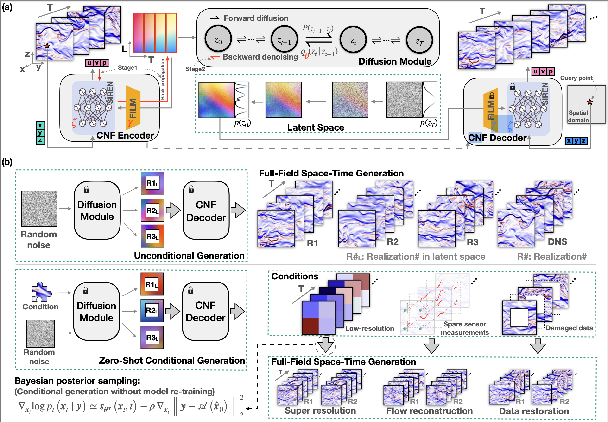

# CoNFILD
This is the codebase for the paper [Du, P., Parikh, M.H., Fan, X., Liu, X.Y. and Wang, J.X., 2024. CoNFiLD: Conditional Neural Field Latent Diffusion Model Generating Spatiotemporal Turbulence. arXiv preprint arXiv:2403.05940.](https://arxiv.org/abs/2403.05940) (Accepted in *Nature Communications*)

<p align="center"></p>

## Create python Environment

create a conda environment named "CoNFiLD"

1. install `conda` managed packages
    ```bash
    conda env create -f env.yml
    ```
2. change `conda` environment
    ```bash
    conda activate CoNFiLD
    ```
3. install `pip` managed packages
    ```bash
    pip install -r requirements_pip.txt
    ``` 
## Training setup
* Create a `.env` file in the CoNFiLD directory and copy the following settings within the file
    ```bash
    PYTHONPATH=./:UnconditionalDiffusionTraining_and_Generation:ConditionalNeuralField:$PYTHONPATH
    CUDA_VISIBLE_DEVICES= #set your GPU number here
    ```

* Run the following bash command
    ```bash
    set -o allexport && source .env && set +o allexport
    ```
## Training Conditional Neural Field
* Use `train.py` under `ConditionalNeuralField/scripts` directory
    ```bash
    python ConditionalNeuralField/scripts/train.py PATH/TO/YOUR/xxx.yaml
    ```

* To reproduce the results form the paper, download and add the corresponding case data in the `ConditionalNeuralField/data` directory use the `ConditionalNeuralField/training_recipes/case{1,2,3,4}.yml`

    * The `ConditionalNeuralField/data` directory should be populated as follows
        ```
        data # all the input files for CNF
        |
        |-- data.npy # data to fit
        | 
        |-- coords.npy # query coordinates
        ```
## Training Diffusion Model
* Use `train.py` under `UnconditionalDiffusionTraining_and_Generation/scripts` directory
    ```bash
    python UnconditionalDiffusionTraining_and_Generation/scripts/train.py
    ```
* To reproduce the results from the paper, download and add the corresponding case data in the `UnconditionalDiffusionTraining_and_Generation/data` and use the `UnconditionalDiffusionTraining_and_Generation/training_recipes/case{1,2,3,4}.yml`

    * The `UnconditionalDiffusionTraining_and_Generation/data` directory should be populated as follows
        ```
        data # all the input files for diffusion model
        |
        |-- train_data.npy # training data
        | 
        |-- valid_data.npy # validation data
        ```
## Generating Conditional Samples
* Here we provide the conditional generation script for Case4 random sensors case
    * For creating your arbitrary conditioning, please define your forward function in `ConditionalDiffusionGeneration/src/guided_diffusion/measurements.py`
    
* To understand the conditional generation process, please follow the instructions in the Jupyter Notebook `ConditionalDiffusionGeneration/inference_scripts/Case4/random_sensor/inference_phy_random_sensor.ipynb`

* For running the Jupyter Notebook, you will need a `input` directory at the same path. 
    * For Case 4 random sensors, a reference input directory has been constructed. The path to it is : `ConditionalDiffusionGeneration/inference_scripts/Case4/random_sensor/input`
    * The file structure of the `input` directory should be as follows 
    ```
    | input
    |
    |-- cnf_model # Files for CNF decoding
    |  |
    |  |-- coords.npy # query coordinates
    |  |
    |  |-- infos.npz  # geometry mask data
    |  |
    |  |-- checkpoint.pt # trainable parameters for the CNF part
    |  |
    |  |-- normalizer.pt # normalization parameters for CNF
    |  
    |-- data scale # Min-Max for denormalizing the latents
    |  |
    |  |-- data_max.npy
    |  |
    |  |-- data_min.npy
    |
    |-- diff_model # Files for diffusion model
    |  |
    |  |-- ema_model.pt # trainable parameters for the diffusion part
    |
    |-- random_sensor # sensor measurements
    |  |
    |  |-- number of sensors
    |  |-- ...
    ```
## Download data & trained model
* The data associated with this code can be downloaded from the [XXX]()
* The data is organzied in the following manner
    ```
    | data 
    |
    |-- Cases
    |  |
    |  |-- Case1
    |  |  |
    |  |  |-- CNF_trainable_params.zip # Trainable params associated with CNF
    |  |  |
    |  |  |-- diffusion_trainable_params.zip # Trainable params associated with diffusion
    |  |  |
    |  |  |-- CNF_data.zip # Training data for CNF
    |  |  |
    |  |  |-- Diffusion_data.zip # Training data for diffusion
    |  |
    |  |-- Case{2,3} # same file structure as case 1
    |  |
    |  |-- Case4
    |  |  |-- {same files as Case 1}
    |  |  |
    |  |  |-- Conditional_Generation_input.zip # Data required for Conditional Generation
    |  |  |
    ```
## Issues?
* If you have an issue in running the code please [raise an issue](https://github.com/jx-wang-s-group/CoNFiLD/issues)

## Citation
If you find our work useful and relevant to your research, please cite:
```
@article{du2024confild,
    title={CoNFiLD: Conditional Neural Field Latent Diffusion Model Generating Spatiotemporal Turbulence},
    author={Du, Pan and Parikh, Meet Hemant and Fan, Xiantao and Liu, Xin-Yang and Wang, Jian-Xun},
    journal={arXiv preprint arXiv:2403.05940},
    year={2024}
    }
``` 


